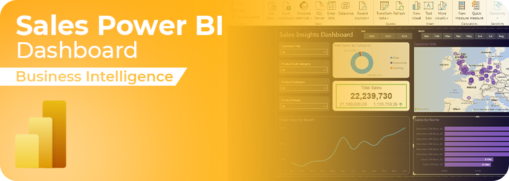
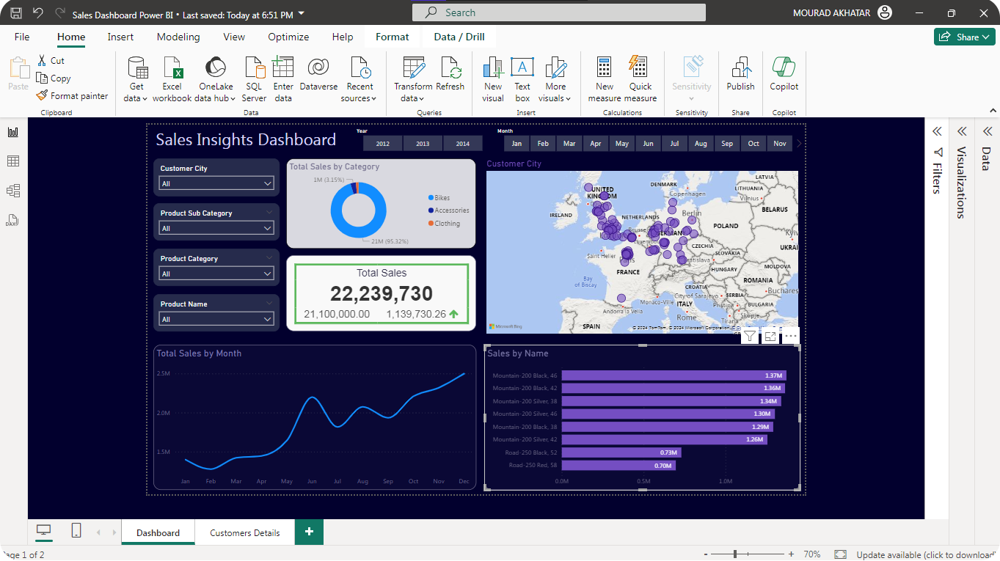
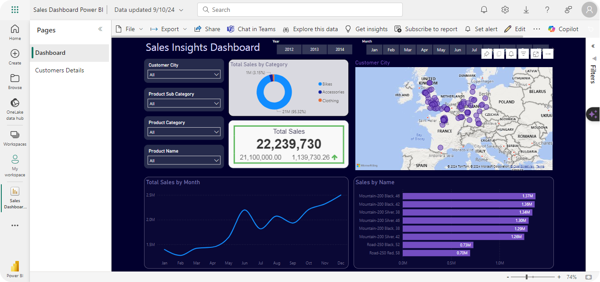
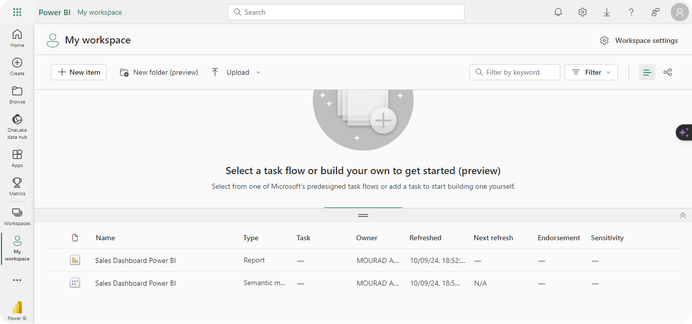

# Sales Analysis Dashboard using Power BI & SQL Server

A Power BI dashboard for X Company that visualizes sales data from SQL Server. It offers insights into sales performance, trends, and metrics with interactive charts and filters for easy analysis.



## Usage

Use the [Power BI](https://app.powerbi.com/) file to get the dashboard

```bash
Sales Dashboard Power BI.pbix
```

## Details

This project provides a comprehensive sales analysis solution through the following steps:

- Data Organization: Employs SQL Server to manage, filter, and manipulate data, exporting it as CSV files.
- Data Transformation: Utilizes Power Query for transforming the data.
- Visualization: Leverages Power BI and DAX for creating interactive visualizations and detailed insights.


## Demo

Interactive Demonstration of the Power BI Dashboard



Publishing the dashboard in Power BI Workspace





## Contact

[](https://www.linkedin.com/in/akhatarmourad/)

[](https://www.instagram.com/devdescom/)